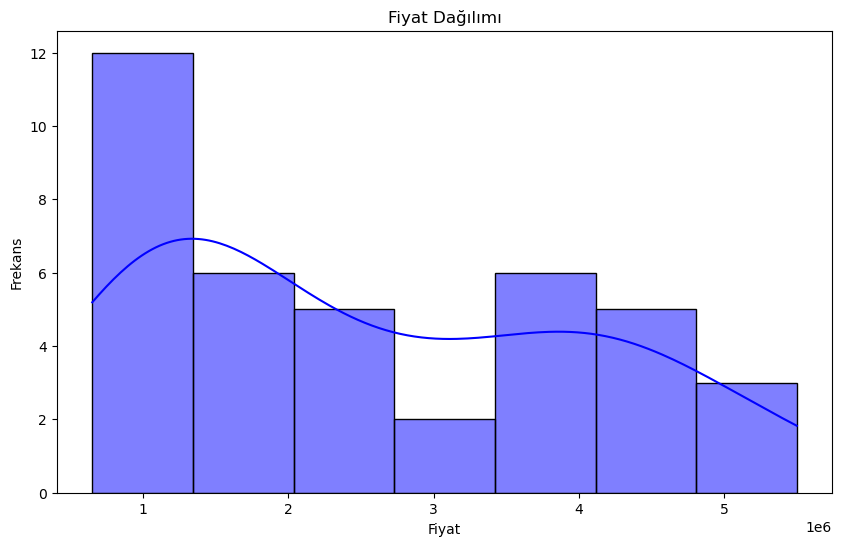
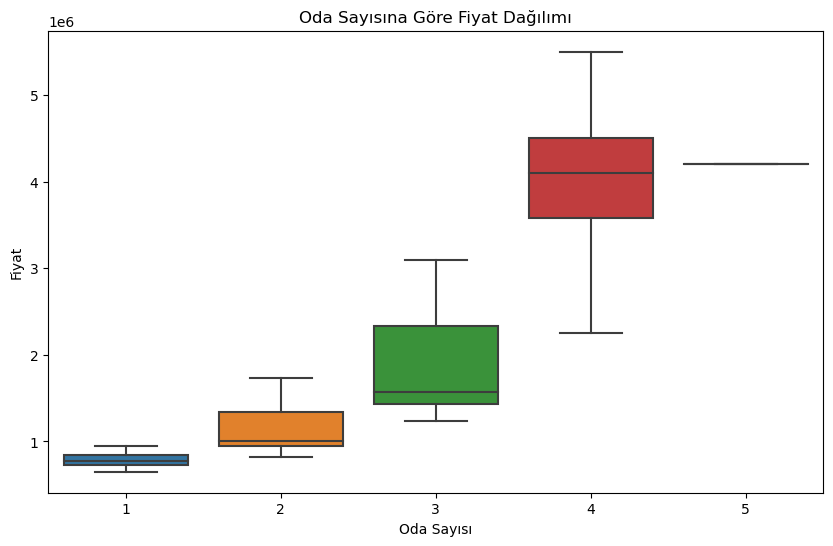
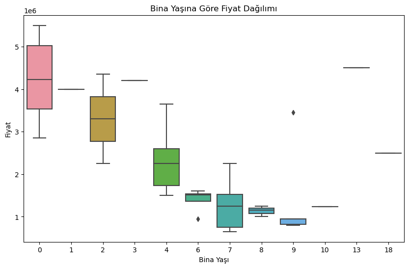
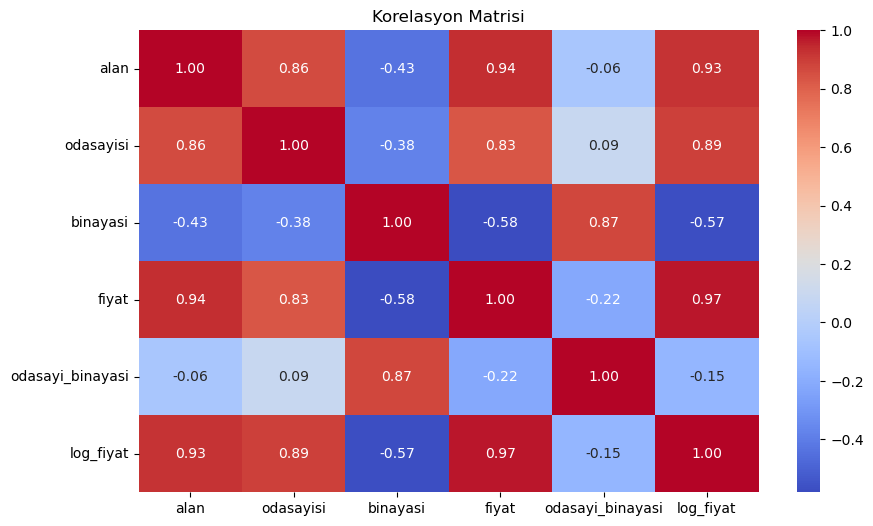

# HomePrice-AI

A machine learning desktop application that predicts house prices using Multiple Linear Regression and Random Forest algorithms.

---

## 📊 Results

### Price Distribution

### Price by Number of Rooms

### Price by Building Age

### Correlation Matrix

---

## 📈 Model Performance

| Metric | Linear Regression | Random Forest |
|--------|-------------------|---------------|
| **MAE** | 320,014 TL | 151,508 TL |
| **RMSE** | 422,077 TL | 213,440 TL |
| **Cross-Val MSE** | 217B | 314B |

**Winner: Random Forest** - Lower MAE and RMSE values indicate better prediction accuracy.

---

## 🏗️ Project Structure

    HomePrice-AI/
    ├── data/
    │   └── FatihEvFiyatları.csv
    ├── notebooks/
    │   └── home-price-predict-enhanced.ipynb
    ├── results/
    │   ├── price_distribution.png
    │   ├── rooms_vs_price.png
    │   ├── age_vs_price.png
    │   └── correlation_matrix.png
    ├── .gitignore
    ├── requirements.txt
    └── README.md

---

## 📋 Dataset

| Info | Details |
|------|---------|
| **Source** | Manually collected (Fatih, Istanbul) |
| **Records** | 39 houses |
| **Features** | Area (m²), Room Count, Building Age |
| **Target** | House Price (TL) |
| **Price Range** | 650,000 - 5,500,000 TL |

### Features

|
